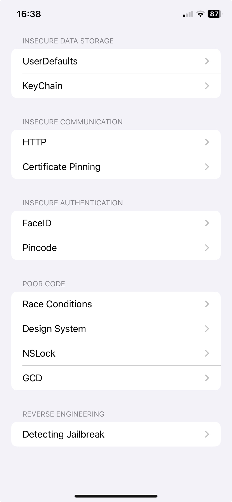
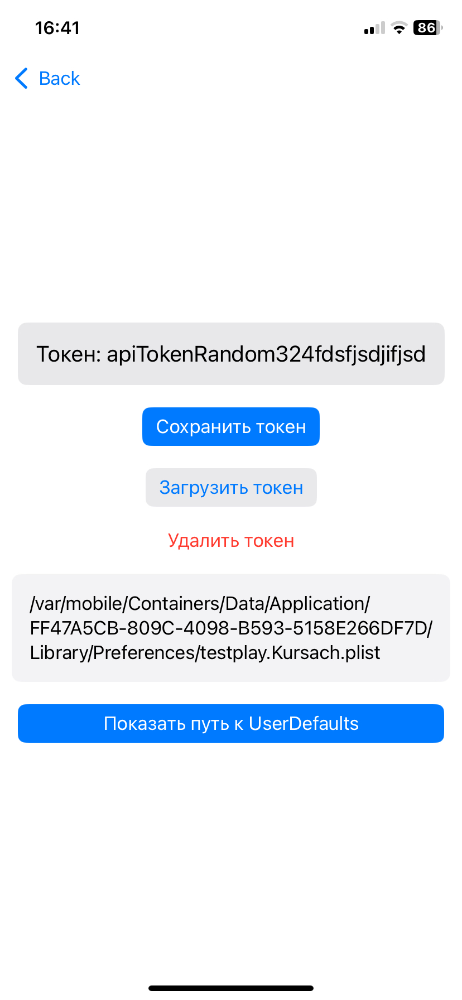
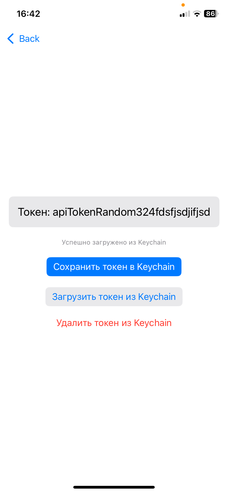
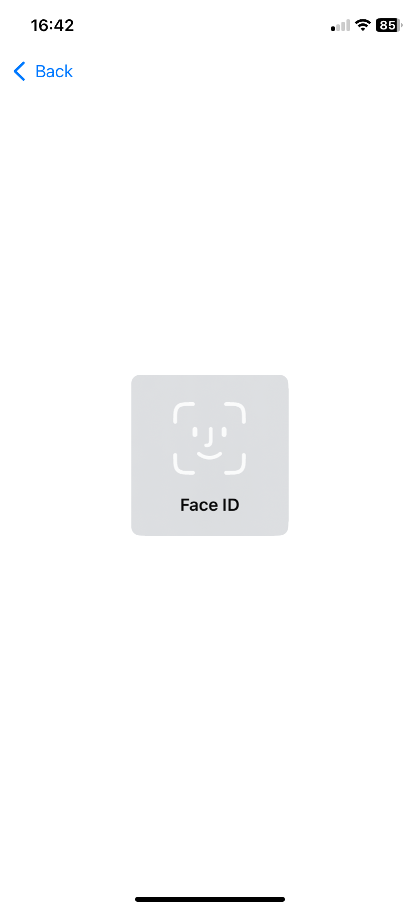
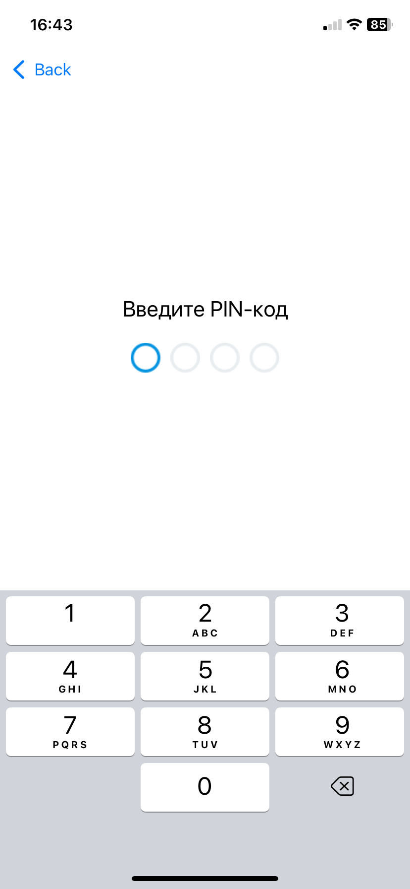
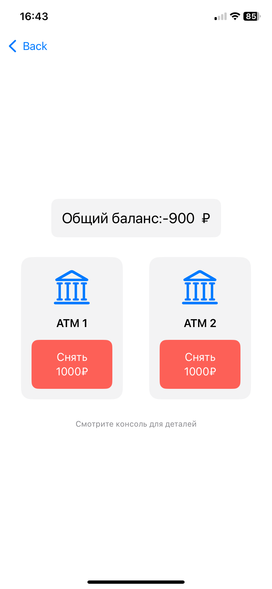
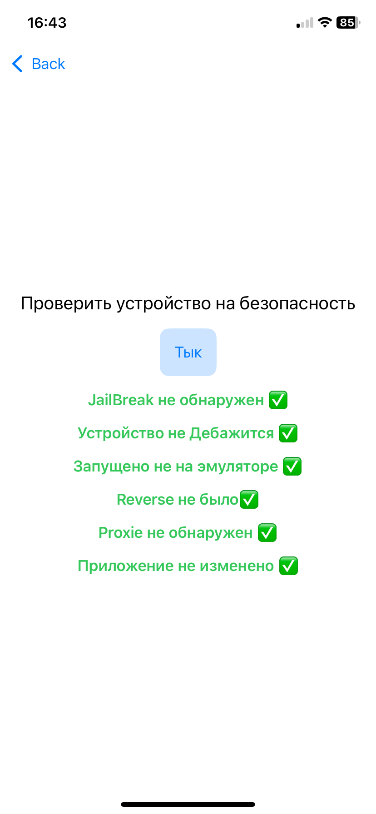
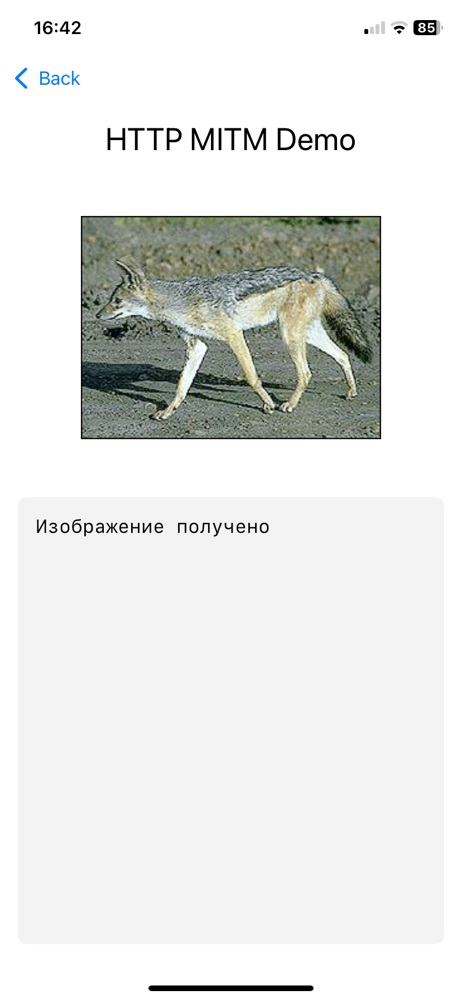
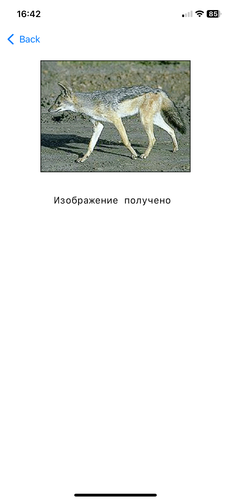

# Курсовой проект по iOS безопасности

## Описание проекта
Демонстрационное iOS-приложение на SwiftUI, исследующее аспекты безопасности мобильных приложений. Проект показывает как правильные, так и неправильные практики безопасности.

## Структура проекта

### 1. InsecureDataStorage
- **UserDefaults** - Небезопасное хранение данных
- **KeyChain** - Безопасное хранение данных

  
  

### 2. InsecureAuth
- **FaceID** - Биометрическая аутентификация
- **Pincode** - Аутентификация по PIN-коду

  
  

### 3. PoorCode
- **Race Conditions** - Проблемы гонки условий
- **NSLock/GCD** - Решения для многопоточности

### 4. ReverseEngineering
- **Detecting Jailbreak** - Определение джейлбрейка

### 5. InsecureCommunication
- **HTTP** - Небезопасная коммуникация
- **Certificate Pinning** - SSL-пиннинг

  
  

## Технические детали
- Разработано с использованием SwiftUI
- Минимальная версия iOS: определяется в Info.plist
- Использует современные практики iOS-разработки
- Включает примеры как безопасных, так и небезопасных реализаций

## Особенности
- Интерактивный пользовательский интерфейс
- Демонстрация различных сценариев безопасности
- Образовательные примеры для каждого аспекта безопасности
- Подробные комментарии в коде

## Установка
1. Клонируйте репозиторий
2. Откройте `Kursach.xcodeproj` в Xcode
3. Выберите целевое устройство или симулятор
4. Нажмите Run (⌘R)
